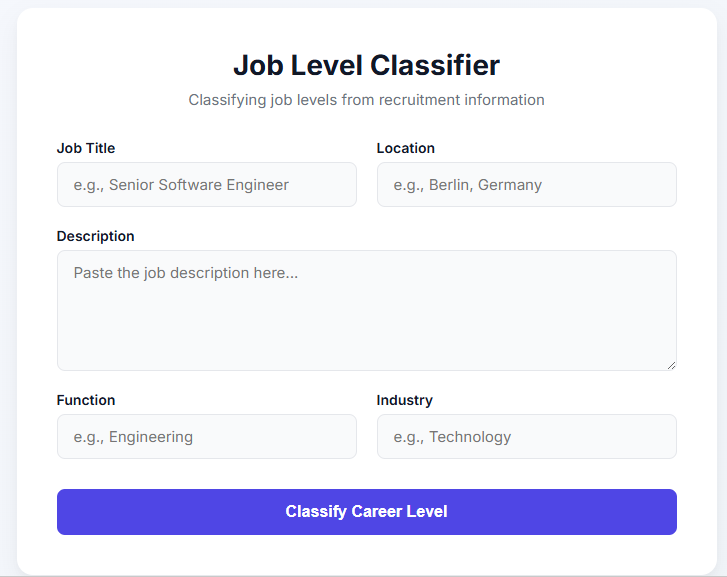

# Job Level Classification

A Machine Learning web application for predicting the **career level of a job posting** from recruitment information such as job title, description, location, function, and industry.

The project uses job-posting data from the **German job market** and follows an end-to-end Machine Learning workflow: data exploration, preprocessing, text feature extraction, model comparison, class-imbalance analysis, error analysis, model serialization, and REST API deployment.

---

## Web Demo

The trained model is integrated into a simple web interface where users can enter job-posting information and receive a predicted career level.



### Example Input

The interface accepts:

- **Job Title** — e.g. `Senior Software Engineer`
- **Location** — e.g. `Berlin, Germany`
- **Description** — the job description
- **Function** — e.g. `Engineering`
- **Industry** — e.g. `Technology`

After clicking **Classify Career Level**, the frontend sends the input to the Flask REST API, which loads the trained Machine Learning pipeline and returns the predicted career level.

### System Flow

```text
User
 │
 ▼
Web Interface
(HTML / CSS / JavaScript)
 │
 │ HTTP POST /predict
 ▼
Flask REST API
 │
 ▼
Saved ML Pipeline
 │
 ├── TF-IDF
 ├── One-Hot Encoding
 ├── Feature Selection
 └── LinearSVC
 │
 ▼
Predicted Career Level
 │
 ▼
Web Interface
```


## Project Overview

Recruitment platforms contain a large number of job postings with different career levels. Automatically classifying these postings can help organize job listings and can serve as a component of recruitment-related applications.

The goal of this project is to build a **multiclass classification model** that predicts the career level of a job posting from the information available in the posting.

### Input Features

| Feature | Description |
|---|---|
| `title` | Job title |
| `location` | Job location |
| `description` | Job description |
| `function` | Job function |
| `industry` | Industry |

### Target

| Target | Description |
|---|---|
| `career_level` | Career level of the job posting |

This is formulated as a **multiclass classification problem**.

---

## Dataset

The dataset contains **8,074 job postings** and 6 columns.

The data consists of job postings from the **German job market**.

| Feature | Type | Description |
|---|---|---|
| `title` | Text | Job title |
| `location` | Categorical/Text | Job location |
| `description` | Text | Job description |
| `function` | Categorical/Text | Job function |
| `industry` | Categorical/Text | Industry |
| `career_level` | Target | Career-level class |

### Data Quality

During Exploratory Data Analysis:

- **8,074** job postings were identified.
- **1** missing value was found.
- **21** duplicate records were identified.
- The target variable is **highly imbalanced**.
- Some career-level classes contain very few samples, making them more difficult to learn and evaluate reliably.

Because the dataset is imbalanced, **Macro F1-score** is used as the primary evaluation metric rather than relying only on accuracy.

---

## Machine Learning Workflow

### 1. Exploratory Data Analysis

The first stage focuses on understanding the dataset and identifying potential problems before training.

Main tasks:

- Inspecting dataset dimensions
- Checking missing values
- Detecting duplicate records
- Analyzing target distribution
- Examining categorical features
- Investigating class imbalance

Notebook:

```text
notebooks/01_eda.ipynb
```

---

### 2. Baseline Model

A baseline Machine Learning pipeline was created to establish an initial performance benchmark.

#### Text Features

TF-IDF Vectorization was applied to:

- `title`
- `description`

The description also uses unigram and bigram representations:

```python
ngram_range=(1, 2)
```

#### Categorical Features

One-Hot Encoding was applied to:

- `location`
- `function`
- `industry`

#### Baseline Classifier

The baseline model uses:

```text
Logistic Regression
```

Notebook:

```text
notebooks/02_baseline.ipynb
```

---

### 3. Model Comparison

Three Machine Learning algorithms were compared using the same dataset split and preprocessing pipeline:

- Logistic Regression
- LinearSVC
- Random Forest

Because the dataset is highly imbalanced, **Macro F1-score** was selected as the primary metric.

### Results

| Model | Accuracy | Macro F1 | Weighted F1 |
|---|---:|---:|---:|
| Logistic Regression | 0.762 | 0.412 | 0.751 |
| **LinearSVC** | **0.759** | **0.668** | **0.749** |
| Random Forest | 0.760 | 0.417 | 0.730 |

Although Logistic Regression achieved slightly higher accuracy, **LinearSVC achieved a substantially higher Macro F1-score**.

Therefore, LinearSVC was selected as the final model because Macro F1 is more informative for this imbalanced multiclass classification problem.

Notebook:

```text
notebooks/03_model_comparison.ipynb
```

---

### 4. Handling Class Imbalance

The target variable contains significant class imbalance, with some career levels having very few samples.

The following approaches were investigated:

- Original training setup
- Class weighting
- Random oversampling

The final model uses:

```python
LinearSVC(class_weight="balanced")
```

Class weighting gives greater importance to minority classes during training.

Notebook:

```text
notebooks/04_imbalance_experiment.ipynb
```

---

### 5. Error Analysis

A confusion matrix was used to investigate the model's predictions and identify common classification errors.

The main confusion occurred between:

- `bereichsleiter`
- `manager_team_leader`
- `senior_specialist_or_project_manager`

These career levels can have overlapping terminology and responsibilities.

For example, job postings containing terms such as:

- Manager
- Director
- Lead
- Senior
- Project Manager

may belong to different career-level categories.

This suggests that some errors are caused not only by model limitations, but also by ambiguity between the career-level labels themselves.

Notebook:

```text
notebooks/05_error_analysis.ipynb
```

---

## Final Model

The final Machine Learning pipeline consists of:

```text
Job Posting
     │
     ├── Title
     ├── Description
     ├── Location
     ├── Function
     └── Industry
     │
     ▼
ColumnTransformer
     │
     ├── TF-IDF
     └── One-Hot Encoding
     │
     ▼
Feature Selection
     │
     ▼
LinearSVC
     │
     ▼
Predicted Career Level
```

The classifier uses:

```python
LinearSVC(class_weight="balanced")
```

The complete trained pipeline is serialized using `joblib`:

```text
models/final_model.pkl
```

Because preprocessing is included in the saved pipeline, new job postings can be passed directly to the model without manually applying TF-IDF, One-Hot Encoding, or feature selection.

---

## Prediction

The trained model can be loaded with:

```python
import joblib

model = joblib.load("models/final_model.pkl")
```

A new job posting can be represented as a pandas DataFrame:

```python
import pandas as pd

new_job = pd.DataFrame([{
    "title": "Senior Software Engineer",
    "location": "Berlin",
    "description": "We are looking for a senior software engineer to develop software applications.",
    "function": "IT",
    "industry": "Information Technology"
}])

prediction = model.predict(new_job)

print("Predicted career level:", prediction[0])
```

The model returns the predicted career level.

Prediction functionality is also implemented in:

```text
src/predict.py
```

---

## REST API

The trained model is exposed through a REST API built with **Flask**.

The API provides a `/predict` endpoint that accepts job-posting information in JSON format.

### Run the API

From the project root:

```bash
python api/app.py
```

The API will be available at:

```text
http://127.0.0.1:5000
```

### Health Check

```http
GET /
```

Example response:

```json
{
    "message": "Job Career Level Classification API"
}
```

### Prediction Endpoint

```http
POST /predict
```

Example request:

```json
{
    "title": "Senior Software Engineer",
    "location": "Berlin",
    "description": "We are looking for a senior software engineer to develop software applications.",
    "function": "IT",
    "industry": "Information Technology"
}
```

Example response:

```json
{
    "predicted_career_level": "senior_specialist_or_project_manager"
}
```

API files:

```text
api/app.py
api/test_api.py
```

---

## Installation

### 1. Clone the repository

```bash
git clone <repository-url>
cd Job-Level-Classification
```

### 2. Create a virtual environment

```bash
python -m venv .venv
```

### 3. Activate the environment

#### Windows

```bash
.venv\Scripts\activate
```

### 4. Install dependencies

```bash
pip install -r requirements.txt
```

---

## Running the Application

The project consists of a Machine Learning backend/API and a web interface.

### Start the Flask API

```bash
python api/app.py
```

### Start the frontend

If the frontend is composed of static HTML/CSS/JavaScript files, it can be served locally with:

```bash
python -m http.server 8000
```

Then open:

```text
http://127.0.0.1:8000
```

Make sure the Flask API is running at the same time so that the frontend can send prediction requests to `/predict`.

> The exact frontend start command may depend on the files included in the repository.

---

## Technologies

### Programming & Data

- Python
- Pandas
- NumPy
- Jupyter Notebook

### Machine Learning

- Scikit-learn
- Imbalanced-learn
- TF-IDF
- One-Hot Encoding
- ColumnTransformer
- Feature Selection
- Linear Support Vector Machine
- Class Weighting
- Multiclass Classification
- Confusion Matrix
- F1-score

### Deployment & Web

- Flask
- REST API
- HTML
- CSS
- JavaScript
- Joblib

---

## Evaluation

The selected final model achieved:

| Metric | Score |
|---|---:|
| Accuracy | **0.759** |
| Macro F1 | **0.668** |
| Weighted F1 | **0.749** |

**Macro F1** is treated as the primary metric because the dataset contains highly imbalanced career-level classes.

---

## Key Takeaways

This project demonstrates an end-to-end Machine Learning workflow:

1. Data exploration
2. Data cleaning
3. Feature engineering
4. Text vectorization
5. Categorical feature encoding
6. Baseline modeling
7. Model comparison
8. Class imbalance analysis
9. Error analysis
10. Model serialization
11. REST API deployment
12. Web-based prediction interface

The project also demonstrates why evaluation metrics should be selected based on the characteristics of the dataset rather than relying solely on accuracy.

---

## Limitations

Several limitations remain:

- Some career-level classes contain very few training examples.
- Career-level boundaries can be semantically ambiguous.
- The current text preprocessing uses English stop-word removal, while the dataset is from the German job market.
- The dataset may not fully represent job postings from other countries or industries.
- The current model is based on classical Machine Learning and does not use contextual transformer-based language representations.

---

## Future Improvements

Possible improvements include:

- Using German-specific NLP preprocessing and stop-word lists
- Using German-language word embeddings
- Hyperparameter optimization
- Experimenting with transformer-based models
- Improving handling of extremely rare classes
- Adding confidence/probability-style model explanations where appropriate
- Improving the web interface and user feedback
- Containerizing the application with Docker
- Deploying the API to a cloud platform

---

## Project Structure

```text
Job-Level-Classification/
│
├── api/
│   ├── app.py
│   └── test_api.py
│
├── models/
│   └── final_model.pkl
│
├── notebooks/
│   ├── 01_eda.ipynb
│   ├── 02_baseline.ipynb
│   ├── 03_model_comparison.ipynb
│   ├── 04_imbalance_experiment.ipynb
│   └── 05_error_analysis.ipynb
│
├── src/
│   ├── train.py
│   └── predict.py
│
├── assets/
│   └── web-demo.png
│
├── .gitignore
├── requirements.txt
└── README.md
```

---

## Author

**Pham Trung Chinh**

Computer Science Student — HUST
